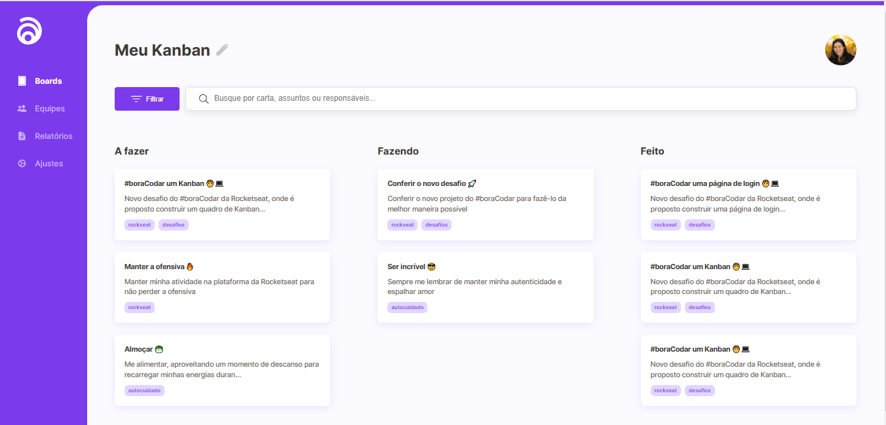

#  📝 Kanban

 This repository has a Kanban designed by Daniel Duarte. 
 You can check the layout here 🔗[Layout](https://www.figma.com/community/file/1220368226816658013)

 

# 🛠️ Technology

Project developed with these technologies:

- HTML e CSS
- Git e Github
- Javascript

 

# 🏆 My extra mile
- Add favicon
- Add function to include ellipsis on the cards paragraphs.

 

# 🚀 Deploy

[Kanban](https://)

 
 

# 🔎 Preview

 

#   💻 Contact me

 
  

 Made by [**Amandatec**](https://www.linkedin.com/in/amanda-oliveira-20/">)