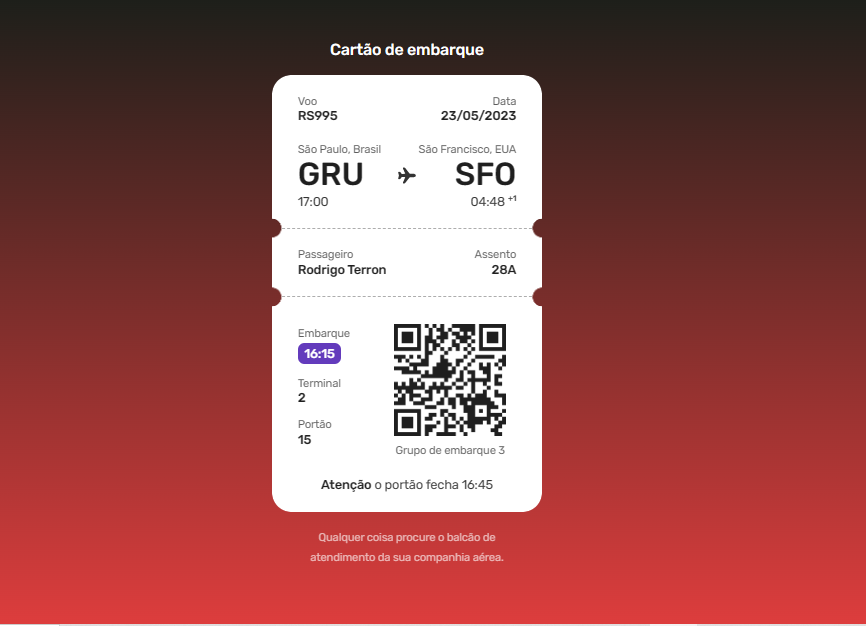

#  ✈ Boarding Pass

 This repository has a boarding pass designed by Ilana Mallak. 
 You can check the layout here 🔗[Layout](https://www.figma.com/community/file/1205146101173113980)

## 🛠️ Technology

Project developed with these technologies:

- HTML e CSS
- Git e Github

## 🚀 Deploy

[Boarding Pass](https://)

## 🔎 Preview

##   💻 Contact me

 
  

 Made by [**Amandatec**](https://www.linkedin.com/in/amanda-oliveira-20/">)